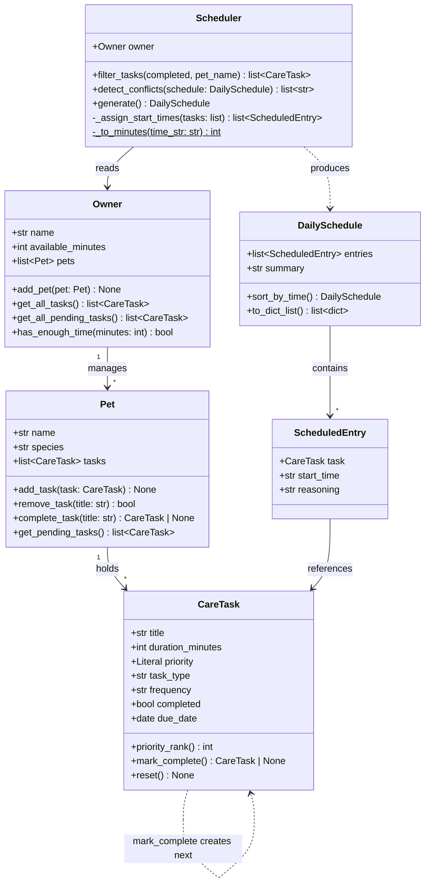

# PawPal+ Project Reflection

## 1. System Design

**Core user actions**

1. **Set up owner and pet profile** — The user enters basic information about themselves and their pet (e.g., pet name, species, owner time availability). This profile acts as the input context that constrains what the scheduler can realistically plan.

2. **Add and edit care tasks** — The user creates tasks representing pet care activities (walks, feeding, medications, grooming, enrichment, etc.), specifying at minimum a duration and a priority level. Users can also edit or remove existing tasks to keep the list current.

3. **Generate and review a daily plan** — The user triggers the scheduler to produce a prioritized daily schedule based on the active tasks and the owner's constraints. The app displays the resulting plan clearly and explains why certain tasks were included, ordered, or omitted.

---

**Objects (classes) in the system**

1. **Owner** — Represents the person using the app.
   - *Attributes:* `name` (the owner's display name); `available_minutes` (how many minutes they have free for pet care today)
   - *Methods:* `has_enough_time(minutes)` — checks whether a given task duration fits within the owner's remaining available time and returns true or false

2. **Pet** — Represents the animal being cared for.
   - *Attributes:* `name` (the pet's name); `species` (e.g. dog, cat, other)
   - *Methods:* none yet — Pet is a simple data-holding object; the Scheduler references it to personalize the plan's reasoning text

3. **CareTask** — Represents a single care activity the owner wants to get done.
   - *Attributes:* `title` (short name, e.g. "Morning walk"); `duration_minutes` (how long the task takes); `priority` (low, medium, or high); `task_type` (category such as exercise, feeding, medication, or grooming)
   - *Methods:* `priority_rank()` — converts the text priority into a number (high = 3, medium = 2, low = 1) so tasks can be sorted consistently without string comparisons scattered across the codebase

4. **ScheduledEntry** — Represents one task as it appears in the final plan, pairing the task with a start time and an explanation.
   - *Attributes:* `task` (the CareTask being scheduled); `start_time` (wall-clock time, e.g. "08:00"); `reasoning` (one sentence explaining why this task was included and placed at this time)
   - *Methods:* none — this is a result record that bundles everything the UI needs to display a single row of the schedule

5. **Scheduler** — Contains all the logic for turning a list of tasks and the owner's time budget into an ordered, time-stamped daily plan.
   - *Attributes:* `owner` (provides the available-time constraint); `pet` (used to personalize the reasoning text); `tasks` (the pool of CareTask objects to consider)
   - *Methods:* `generate()` — sorts tasks by priority, fits them within the available time window, and returns a complete DailySchedule; `_assign_start_times(entries)` — private helper that walks a sorted task list, assigns sequential start times from 08:00, and writes a reasoning string for each entry

6. **DailySchedule** — The output artifact: an ordered list of scheduled entries plus a human-readable summary.
   - *Attributes:* `entries` (ordered list of ScheduledEntry objects); `summary` (e.g. "3 of 5 tasks fit in Jordan's 60-minute window")
   - *Methods:* `to_dict_list()` — converts entries into plain dicts so the result can be passed directly to `st.table()` in the Streamlit UI

---

**Class diagram**

---

**a. Initial design**

The initial design uses six classes with clearly separated responsibilities:

- **Owner** — holds the human user's name and daily time budget. Responsible for answering whether a given task duration fits within the remaining available time (`has_enough_time`). It is the source of the scheduling constraint.
- **Pet** — a simple data-holding class for the animal's name and species. It has no behavior of its own; the Scheduler references it to personalize the reasoning text in the output plan.
- **CareTask** — represents a single care activity. Responsible for storing what needs to happen (title, type, duration) and how urgently (priority). It owns the logic for converting its text priority into a sortable number (`priority_rank`), keeping that knowledge local to the class rather than scattered across the scheduler.
- **ScheduledEntry** — a result record that pairs a CareTask with a concrete start time and a one-sentence explanation. It has no behavior; its role is to bundle the output data the UI needs to display one row of the schedule.
- **Scheduler** — the only class with significant logic. Given an Owner, a Pet, and a list of CareTasks, it decides which tasks fit in the time window and in what order, then returns a complete DailySchedule. The logic is split across two methods: `generate` (selection and ordering) and `_assign_start_times` (time arithmetic and reasoning text).
- **DailySchedule** — the output artifact. Holds the ordered list of ScheduledEntry objects and a human-readable summary line. Responsible for converting its entries into plain dicts via `to_dict_list` so the Streamlit UI can hand the result directly to `st.table`.

**b. Design changes**

**Change 1 — `CareTask.priority` narrowed from `str` to `Literal["low", "medium", "high"]`**

The initial UML typed `priority` as a plain string. During skeleton review it became clear that `priority_rank()` can only work correctly for three specific values, so any other string would cause a silent logic failure. Changing the type annotation to `Literal["low", "medium", "high"]` encodes this constraint directly in the class definition, so type-checkers and IDEs flag bad inputs before the code even runs.

**Change 2 — `Owner → Pet` ownership relationship removed from `Owner`**

The initial UML showed `Owner "1" --> "1" Pet : owns`, implying `Owner` should hold a `pet` attribute. In practice, the Streamlit UI collects owner info and pet info as separate form inputs, so both are passed independently to `Scheduler`. Embedding `pet` inside `Owner` would create awkward nesting (`owner.pet.name`) and couple two concepts that the UI treats separately. The relationship was updated: `Scheduler` is now the object that groups `owner` and `pet` together, which better reflects how data flows through the app.

---

## 2. Scheduling Logic and Tradeoffs

**a. Constraints and priorities**

The scheduler considers three constraints, in this order of importance:

1. **Priority** (high / medium / low) — the primary sort key. High-priority tasks like medication or feeding are non-negotiable for pet health, so they must be scheduled first regardless of duration.
2. **Time budget** (`available_minutes`) — the hard ceiling. Once the owner's free time is exhausted, remaining tasks are reported but not scheduled. This prevents the planner from producing an unrealistic day.
3. **Duration** (shorter first within the same priority) — the tiebreaker. When two tasks share a priority level, the shorter one is scheduled first because it's more likely to fit in the remaining window and leaves room for other tasks.

Priority was ranked highest because the scenario is pet *care* — skipping a medication to fit in a grooming session would be a safety failure. Time budget is second because it's an objective physical constraint. Duration as a tiebreaker was chosen over alphabetical order or task type because it maximizes the number of tasks that fit.

**b. Tradeoffs**

The scheduler uses a **greedy algorithm**: it sorts all pending tasks by priority (high → low), then by duration (shorter first), and walks the list adding each task to the plan as long as it fits in the remaining time. Once a task is skipped because it is too long, it is never reconsidered.

This means the scheduler can produce a suboptimal fit. For example, if 20 minutes remain and the next task in priority order needs 25 minutes, the greedy approach skips it — even if two 10-minute lower-priority tasks could fill that gap instead. A knapsack-style algorithm would find the combination that uses the most available time, but it would be significantly more complex to implement and harder to explain to the user in the reasoning text.

The greedy approach is reasonable here because a pet owner cares more about "did the important things get done?" than "was every minute used?" Prioritizing high-priority tasks first and keeping the logic simple and explainable is the right tradeoff for a daily care planner.

---

## 3. AI Collaboration

**a. How you used AI**

AI (Claude Code) was used throughout the project in several distinct roles:

- **Design brainstorming** — Early prompts like "brainstorm the main objects needed for the system" and "for each object, determine what info it needs to hold and what actions it can perform" produced the initial six-class object model. AI was effective at generating a comprehensive first draft quickly, but the human role was deciding which classes actually earned their place versus which were over-engineering.
- **UML generation** — AI produced the Mermaid.js class diagram directly from the brainstormed object descriptions, including relationship arrows and multiplicity. This was the most time-efficient use — translating a natural-language design into diagram syntax is mechanical work that AI handles well.
- **Skeleton-to-implementation** — Prompts like "flesh out the core implementation of the four classes" turned empty stubs into working Python. AI generated the greedy scheduling algorithm, the `timedelta`-based recurrence logic, and the `itertools.combinations` conflict detector.
- **Refactoring** — When asked "how could this algorithm be simplified for better readability?", AI suggested replacing manual `range(len(...))` index loops with `itertools.combinations` in `detect_conflicts()`. This was a genuine improvement — both more Pythonic and more readable.
- **Test generation** — AI produced 15 tests covering happy paths, edge cases, and boundary conditions from a single prompt asking for sorting, recurrence, and conflict coverage.

The most effective prompts were *specific and scoped*: "review the skeleton, check for missing relationships or logic bottlenecks" produced actionable feedback, while vague prompts like "make it better" would have been less useful.

**b. Judgment and verification**

**Rejected suggestion: `Owner` containing a `pet` attribute.**

The initial AI-generated UML showed `Owner "1" --> "1" Pet : owns`, implying Owner should hold a direct reference to a single Pet. This felt clean on a diagram but would have caused problems:

- The Streamlit UI collects owner and pet info in separate form sections — nesting `pet` inside `Owner` would create awkward coupling (`owner.pet.name` instead of just `pet.name`).
- A single `pet` attribute would block the later requirement to support multiple pets.
- The Scheduler needed both objects but didn't need them to be nested.

This was evaluated by tracing how data would actually flow from the UI widgets through session state into the Scheduler. The UI-first analysis revealed that the diagram's "clean" relationship would create friction in practice. The decision: Scheduler holds Owner and Pet(s) as independent inputs, and later Owner was updated to hold a `pets` list when multi-pet support was added. The AI's initial suggestion was structurally valid but didn't account for how the Streamlit data flow would work.

---

## 4. Testing and Verification

**a. What you tested**

The test suite (15 tests in `tests/test_pawpal.py`) covers five categories:

- **Basic operations** (2 tests) — Task completion status toggle and task count after adding to a pet. These verify the foundational building blocks that every other feature depends on.
- **Sorting correctness** (3 tests) — Priority ordering (high before medium before low), duration tiebreaker within the same priority, and chronological `sort_by_time()`. These are critical because incorrect sorting would silently produce a schedule that looks right but prioritizes the wrong tasks.
- **Recurrence logic** (4 tests) — Daily recurrence (+1 day), weekly recurrence (+7 days), one-time tasks (no recurrence), and `Pet.complete_task()` auto-appending the next occurrence. Recurrence bugs would be invisible until a user notices their daily walk stopped appearing.
- **Conflict detection** (3 tests) — Overlapping time ranges flagged, adjacent (non-overlapping) entries pass clean, and identical start times flagged. The adjacent-entries test is especially important — it guards against an off-by-one error where touching-but-not-overlapping tasks get falsely flagged.
- **Edge cases** (3 tests) — Pet with no tasks, owner with zero available minutes, and all tasks already completed. These prevent crashes or confusing output when the system receives empty or degenerate input.

**b. Confidence**

**Confidence: 4 out of 5.**

The test suite covers all core algorithms (sorting, greedy fit, recurrence, conflict detection) and the most likely boundary conditions. The remaining gap is integration-level testing: the tests verify `pawpal_system.py` in isolation but do not exercise the Streamlit UI layer (`app.py`), session state persistence across reruns, or multi-pet interactions where tasks from different pets compete for the same time window. If given more time, the next tests would be:

- A multi-pet scenario where both pets have high-priority tasks that exceed the time budget, verifying fair distribution
- A recurrence chain test: complete a daily task three times in a row and confirm each due date advances correctly
- A Streamlit integration test using `streamlit.testing` to verify that adding a pet via the UI actually populates `st.session_state.owner.pets`

---

## 5. Reflection

**a. What went well**

The cleanest part of this project is the separation between the logic layer (`pawpal_system.py`) and the UI layer (`app.py`). The Scheduler, Owner, Pet, and CareTask classes have zero knowledge of Streamlit — they work identically in `main.py` (terminal), `test_pawpal.py` (pytest), and `app.py` (browser). This made it possible to build and test every algorithm in the terminal before touching the UI, which caught bugs early and kept iteration cycles short. The `DailySchedule.to_dict_list()` bridge method is a small detail that pays off repeatedly: it's the single point where domain objects become UI-ready dicts, so neither side needs to know about the other's internals.

**b. What you would improve**

Two things:

1. **The greedy scheduler should handle multi-pet fairness.** Currently, if Mochi has three high-priority tasks and Whiskers has one, Mochi's tasks dominate the schedule. A fairer algorithm would interleave pets at the same priority level so no single pet monopolizes the time budget.
2. **Task editing and deletion in the UI.** The current app lets users add tasks and toggle completion, but there's no way to change a task's duration or priority after creation, and no delete button. These are basic CRUD operations that a real user would expect.

**c. Key takeaway**

The most important lesson is that **AI is an accelerator, not an architect**. AI generated working code quickly — class skeletons, sorting algorithms, test suites — but every structural decision (which classes to keep, how relationships should flow, whether to use a greedy algorithm or something fancier) required human judgment informed by how the system would actually be used. The Owner-Pet relationship is the clearest example: AI proposed a textbook UML association, but tracing the Streamlit data flow revealed it would create friction. The human role is to hold the full picture — UI flow, user expectations, testing strategy, future extensibility — and use AI to execute the pieces efficiently. Being the "lead architect" means you own the *why* behind every decision; AI handles the *how* of translating that decision into code.
