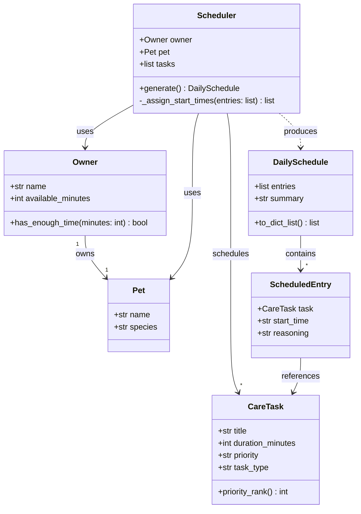

# PawPal+ Project Reflection

## 1. System Design

**Core user actions**

1. **Set up owner and pet profile** — The user enters basic information about themselves and their pet (e.g., pet name, species, owner time availability). This profile acts as the input context that constrains what the scheduler can realistically plan.

2. **Add and edit care tasks** — The user creates tasks representing pet care activities (walks, feeding, medications, grooming, enrichment, etc.), specifying at minimum a duration and a priority level. Users can also edit or remove existing tasks to keep the list current.

3. **Generate and review a daily plan** — The user triggers the scheduler to produce a prioritized daily schedule based on the active tasks and the owner's constraints. The app displays the resulting plan clearly and explains why certain tasks were included, ordered, or omitted.

---

**Objects (classes) in the system**

1. **Owner** — Represents the person using the app.
   - *Attributes:* `name` (the owner's display name); `available_minutes` (how many minutes they have free for pet care today)
   - *Methods:* `has_enough_time(minutes)` — checks whether a given task duration fits within the owner's remaining available time and returns true or false

2. **Pet** — Represents the animal being cared for.
   - *Attributes:* `name` (the pet's name); `species` (e.g. dog, cat, other)
   - *Methods:* none yet — Pet is a simple data-holding object; the Scheduler references it to personalize the plan's reasoning text

3. **CareTask** — Represents a single care activity the owner wants to get done.
   - *Attributes:* `title` (short name, e.g. "Morning walk"); `duration_minutes` (how long the task takes); `priority` (low, medium, or high); `task_type` (category such as exercise, feeding, medication, or grooming)
   - *Methods:* `priority_rank()` — converts the text priority into a number (high = 3, medium = 2, low = 1) so tasks can be sorted consistently without string comparisons scattered across the codebase

4. **ScheduledEntry** — Represents one task as it appears in the final plan, pairing the task with a start time and an explanation.
   - *Attributes:* `task` (the CareTask being scheduled); `start_time` (wall-clock time, e.g. "08:00"); `reasoning` (one sentence explaining why this task was included and placed at this time)
   - *Methods:* none — this is a result record that bundles everything the UI needs to display a single row of the schedule

5. **Scheduler** — Contains all the logic for turning a list of tasks and the owner's time budget into an ordered, time-stamped daily plan.
   - *Attributes:* `owner` (provides the available-time constraint); `pet` (used to personalize the reasoning text); `tasks` (the pool of CareTask objects to consider)
   - *Methods:* `generate()` — sorts tasks by priority, fits them within the available time window, and returns a complete DailySchedule; `_assign_start_times(entries)` — private helper that walks a sorted task list, assigns sequential start times from 08:00, and writes a reasoning string for each entry

6. **DailySchedule** — The output artifact: an ordered list of scheduled entries plus a human-readable summary.
   - *Attributes:* `entries` (ordered list of ScheduledEntry objects); `summary` (e.g. "3 of 5 tasks fit in Jordan's 60-minute window")
   - *Methods:* `to_dict_list()` — converts entries into plain dicts so the result can be passed directly to `st.table()` in the Streamlit UI

---

**Class diagram**

---

**a. Initial design**

The initial design uses six classes with clearly separated responsibilities:

- **Owner** — holds the human user's name and daily time budget. Responsible for answering whether a given task duration fits within the remaining available time (`has_enough_time`). It is the source of the scheduling constraint.
- **Pet** — a simple data-holding class for the animal's name and species. It has no behavior of its own; the Scheduler references it to personalize the reasoning text in the output plan.
- **CareTask** — represents a single care activity. Responsible for storing what needs to happen (title, type, duration) and how urgently (priority). It owns the logic for converting its text priority into a sortable number (`priority_rank`), keeping that knowledge local to the class rather than scattered across the scheduler.
- **ScheduledEntry** — a result record that pairs a CareTask with a concrete start time and a one-sentence explanation. It has no behavior; its role is to bundle the output data the UI needs to display one row of the schedule.
- **Scheduler** — the only class with significant logic. Given an Owner, a Pet, and a list of CareTasks, it decides which tasks fit in the time window and in what order, then returns a complete DailySchedule. The logic is split across two methods: `generate` (selection and ordering) and `_assign_start_times` (time arithmetic and reasoning text).
- **DailySchedule** — the output artifact. Holds the ordered list of ScheduledEntry objects and a human-readable summary line. Responsible for converting its entries into plain dicts via `to_dict_list` so the Streamlit UI can hand the result directly to `st.table`.

**b. Design changes**

**Change 1 — `CareTask.priority` narrowed from `str` to `Literal["low", "medium", "high"]`**

The initial UML typed `priority` as a plain string. During skeleton review it became clear that `priority_rank()` can only work correctly for three specific values, so any other string would cause a silent logic failure. Changing the type annotation to `Literal["low", "medium", "high"]` encodes this constraint directly in the class definition, so type-checkers and IDEs flag bad inputs before the code even runs.

**Change 2 — `Owner → Pet` ownership relationship removed from `Owner`**

The initial UML showed `Owner "1" --> "1" Pet : owns`, implying `Owner` should hold a `pet` attribute. In practice, the Streamlit UI collects owner info and pet info as separate form inputs, so both are passed independently to `Scheduler`. Embedding `pet` inside `Owner` would create awkward nesting (`owner.pet.name`) and couple two concepts that the UI treats separately. The relationship was updated: `Scheduler` is now the object that groups `owner` and `pet` together, which better reflects how data flows through the app.

---

## 2. Scheduling Logic and Tradeoffs

**a. Constraints and priorities**

- What constraints does your scheduler consider (for example: time, priority, preferences)?
- How did you decide which constraints mattered most?

**b. Tradeoffs**

The scheduler uses a **greedy algorithm**: it sorts all pending tasks by priority (high → low), then by duration (shorter first), and walks the list adding each task to the plan as long as it fits in the remaining time. Once a task is skipped because it is too long, it is never reconsidered.

This means the scheduler can produce a suboptimal fit. For example, if 20 minutes remain and the next task in priority order needs 25 minutes, the greedy approach skips it — even if two 10-minute lower-priority tasks could fill that gap instead. A knapsack-style algorithm would find the combination that uses the most available time, but it would be significantly more complex to implement and harder to explain to the user in the reasoning text.

The greedy approach is reasonable here because a pet owner cares more about "did the important things get done?" than "was every minute used?" Prioritizing high-priority tasks first and keeping the logic simple and explainable is the right tradeoff for a daily care planner.

---

## 3. AI Collaboration

**a. How you used AI**

- How did you use AI tools during this project (for example: design brainstorming, debugging, refactoring)?
- What kinds of prompts or questions were most helpful?

**b. Judgment and verification**

- Describe one moment where you did not accept an AI suggestion as-is.
- How did you evaluate or verify what the AI suggested?

---

## 4. Testing and Verification

**a. What you tested**

- What behaviors did you test?
- Why were these tests important?

**b. Confidence**

- How confident are you that your scheduler works correctly?
- What edge cases would you test next if you had more time?

---

## 5. Reflection

**a. What went well**

- What part of this project are you most satisfied with?

**b. What you would improve**

- If you had another iteration, what would you improve or redesign?

**c. Key takeaway**

- What is one important thing you learned about designing systems or working with AI on this project?
